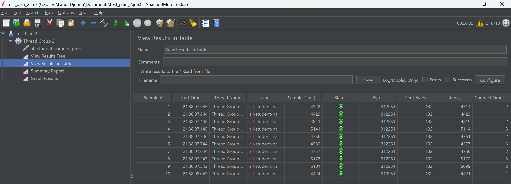
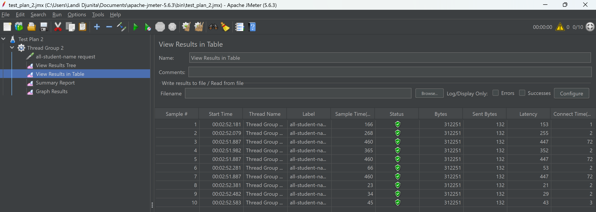
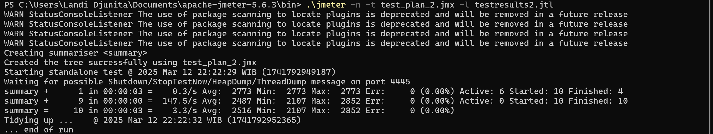
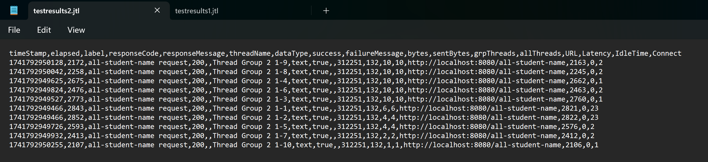
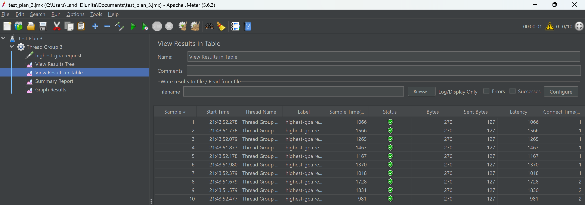
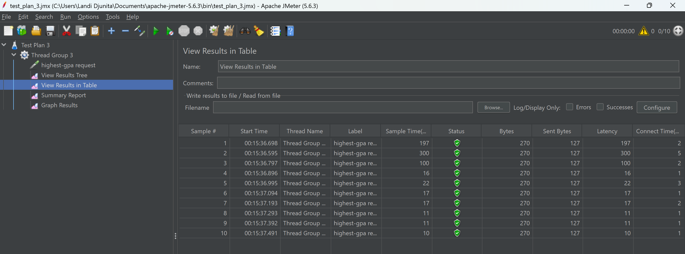
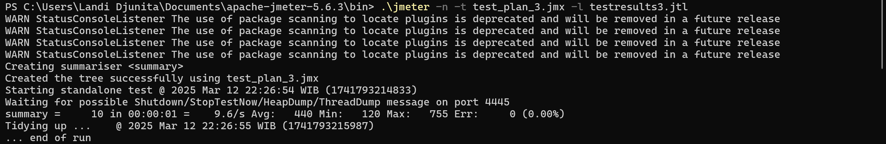
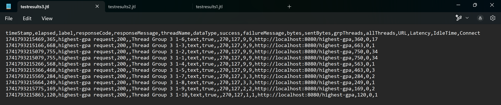

# MODULE 5
--------------
## Optimization Results 

### /all-student-name 
**Before Optimization**

**After Optimization**

**Command Line**

**Test Result**

--------------
### /highest-gpa
**Before Optimization**

**After Optimization**

**Command Line**

**Test Result**

--------------

## Reflection
**1. What is the difference between the approach of performance testing with JMeter and profiling with IntelliJ Profiler in the context of optimizing 
application performance?**
The difference is how JMETER send HTTP requests to endpoints in order to create virtual users that portray/mimic real user activity. 
This allows us to test and stimulate how the application handles multiple requests. On the other hand, IntelliJ Profiler measures CPU time, 
memory usage, and method execution times in order to analyze and pinpoint segments of code that are resource-demanding. 

**2. How does the profiling process help you in identifying and understanding the weak points in your application?**
Profiling helps by collecting the detailed measurements on the different methods of execution along with CPU usage,
which then displays which section of the codes that uses the most resources or consume the most time. 

**3. Do you think IntelliJ Profiler is effective in assisting you to analyze and identify bottlenecks in your application code?**
I think IntelliJ Profiler is effective since it has visualization tools (e.g. flame graphs, method list) to help identify where inefficient code lies.
Other than that it allows us to keep refining our code, and we can immediately see the performance difference real time.

**4. What are the main challenges you face when conducting performance testing and profiling, and how do you overcome these challenges?**
A challenge I face is figuring out which part of the code slows things down, especially when dealing with a large amount of data. This challenge is faced
by creating a set-up that is similar to the real environment.  

**5. What are the main benefits you gain from using IntelliJ Profiler for profiling your application code?**
The main benefit I gained from IntelliJ Profiling is how it provides real-time analysis and insights. This is done by 
tracking the execution time of the methods and the CPU usage. Because of this, it is easy to identify which part of the code
is using a lot of resources. 

**6. How do you handle situations where the results from profiling with IntelliJ Profiler are not entirely consistent with findings from performance testing using JMeter?**
I handle this situation by ensuring the test setup are consistent and run several iterations to see a clear pattern.

**7. What strategies do you implement in optimizing application code after analyzing results from performance testing and profiling? How do you ensure the changes you make do not affect the application's functionality?**
I implemented database query to optimize it. To ensure these changes don't break functionality,a full suite of automated tests is run, and the tests include regression tests. 
Other than that I perform manual checks to validate that all features still work as expected.